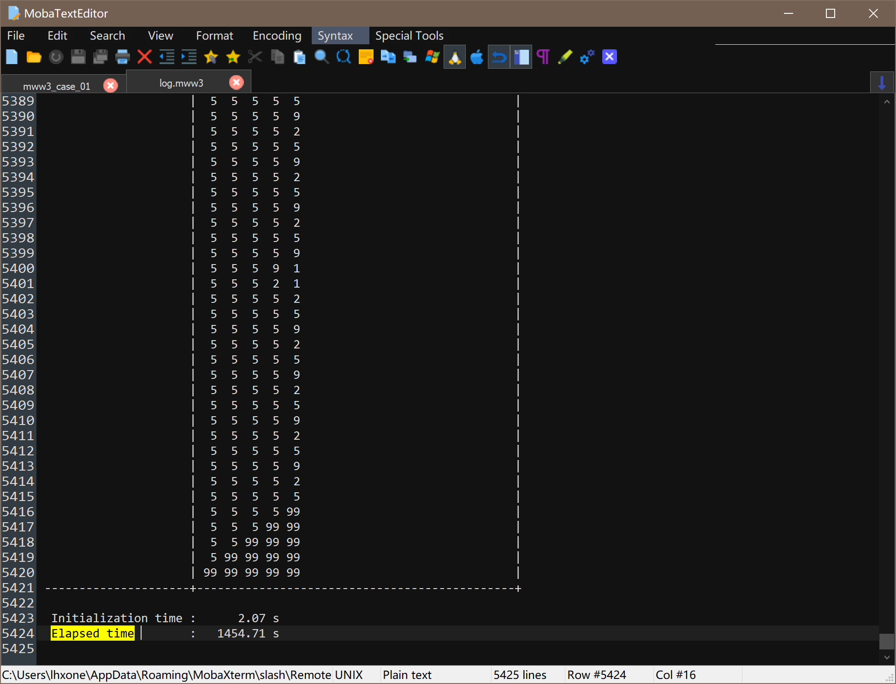

# WAVEWATCH III 6.07.1

WAVEWATCH III介绍：
>WAVEWATCH III ® 是一个社区波浪建模框架，其中包括风波建模和动力学领域的最新科学进展。


### 所需要的软件

| 项目           | 版本         | 下载地址                  |
| -------------- | ------------ | ----------------------------------------------------------------- |
| WAVEWATCH III  | 6.07.1       | https://github.com/NOAA-EMC/WW3/releases/tag/6.07.1               |
| HDF5           | 1.10.1       | http://hdfgroup.org/HDF5/                                         |
| NetCDF         | 4.4.1.1      | https://github.com/Unidata/netcdf-c/releases/tag/v4.4.1.1         |
| NetCDF-FORTRAN | 4.4.1        | https://github.com/Unidata/netcdf-fortran/releases/tag/v4.4.1     |
| PARMETIS       | 4.0.3        | http://glaros.dtc.umn.edu/gkhome/metis/parmetis/download          |
| 测试算例       | mww3_data_01 | [ftp://polar.ncep.noaa.gov/tempor/ww3ftp/ww3_from_ftp.v6.07.tar.gz](ftp://polar.ncep.noaa.gov/tempor/ww3ftp/ww3_from_ftp.v6.07.tar.gz) |


### 获取源码

下载地址[WW3](https://github.com/NOAA-EMC/WW3/releases)

```shell
wget https://github.com/NOAA-EMC/WW3/archive/refs/tags/6.07.1.tar.gz
mv 6.07.1.tar.gz WAVEWATCH-III.v6.07.1.tar.gz
tar xzvf WAVEWATCH-III.v6.07.1.tar.gz
cd WW3-6.07.1/
```

### 环境变量准备


############# gnu + openmpi #################
export PATH=/path/to/GNU/bin:$PATH
export LD_LIBRARY_PATH=/path/to/GNU/lib64:$LD_LIBRARY_PATH
export PATH=/path/to/OpenMPI/bin:$PATH
export LD_LIBRARY_PATH=/path/to/OpenMPI/lib:$LD_LIBRARY_PATH

############# netcdf #################
export NETCDF_DIR=/path/to/NETCDF
export NETCDF_LIBDIR=$NETCDF_DIR/lib
export NETCDF_INCDIR=$NETCDF_DIR/include
export PATH=$NETCDF_DIR/bin:$PATH
export LD_LIBRARY_PATH=$NETCDF_LIBDIR:$LD_LIBRARY_PATH
export WWATCH3_NETCDF=NC4
export NETCDF_CONFIG=$NETCDF_DIR/bin/nc-config

############# metis #################
export METIS_PATH=/path/to/METIS
export PATH=$METIS_PATH/bin:$PATH
export LD_LIBRARY_PATH=$METIS_PATH/lib:$LD_LIBRARY_PATH


载入环境变量

```shell
source env.sh
```

或者可以使用`spack load openmpi`

### 安装配置

执行以下命令安装

```sh
./model/bin/w3_setup model/
```

### 运行与验证

获取[测试样例](ftp://polar.ncep.noaa.gov/tempor/ww3ftp/ww3_from_ftp.v6.07.tar.gz)并解压到测试用目录

```shell
mkdir /path/to/WW3_TEST
cd /path/to/WW3_TEST
wget ftp://polar.ncep.noaa.gov/tempor/ww3ftp/ww3_from_ftp.v6.07.tar.gz
tar -xvf ww3_from_ftp.v6.07.tar.gz
cd cases
```

环境变量设置

```shell
source /path/to/env.sh
export ww3_dir=/path/to/WAVEWATCH/WW3-6.07.1/model
```


修改`mww3_case_01`文件

- 第61行

    #cd /scratch1/portfolios/NCEPDEV/ocean/noscrub/Henrique.Alves/WW3_CASES/cases

- 第65行

    #module load intel mpt grads

- 第72行

    compstr="Gnu"

- 第138行

    proc=96

- 第143行

    #ww3_dir='echo $case_dir | sed 's/\/cases\/*//g''

- 第420行,修改之后出现卡在`Running multi-grid model ...`的情况

    mpirun --allow-run-as-root --mca btl ^openib -np $proc --hostfile /path/to/WW3_TEST/hostfile $path_e/ww3_multi


运行样例，运行时间会特别长...

```shell
./mww3_case_01
```

需要查看“work_case_01/log.mww3”日志中的“Elapsed time”数值，单位是“s”，数值越少性能越优。


